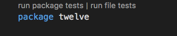
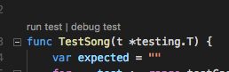

# Практика

> Назви гілок відповідають номеру тижня курсу. week_1, week_2 і так далі
## Початкова підготовка
0. Налаштовуєте git (*опціонально, якщо не налаштовано*)

```sh
git config --global user.name "Your Name"
git config --global user.email "your.email@gmail.com"
git config --global user.password "YOUR PASSWORD"
````

1. Клонуєте базовий репозиторій себе;
2. Змінюєте ім'я remote;
3. Додаєте свій репозиторій як remote;
4. Відправляєте гілку майстер у свій репозиторій;
5. Перемикаєтеся на нову гілку

```sh
git clone https://github.com/yevhenii-babich/go-lessons.git course

cd course
git remote rename origin base

# ІМ'Я_ВАШОГО_РЕПОЗИТОРІЯ - слід замінити
git remote add origin https://github.com/yevhenii-babich/ІМ'Я_ВАШОГО_РЕПОЗИТОРІЯ.git

git remote -v
#base https://github.com/yevhenii-babich/go-lessons.git (fetch)
#base https://github.com/yevhenii-babich/go-lessons.git (push)
#origin https://github.com/yevhenii-babich/ІМ'Я_ВАШОГО_РЕПОЗИТОРІЯ.git (fetch)
#origin https://github.com/yevhenii-babich/ІМ'Я_ВАШОГО_РЕПОЗИТОРІЯ.git (push)

git push -u origin master

git checkout -b week_1
````

## Виконання завдань

У папці з кожним завданням є його опис, файл `main.go` та файли тестів.
Для виконання завдання необхідно відредагувати тіло функції, яка виконуватиме описані дії в завданні.

````
// Тут має бути рішення
// написавши код - необхідно запустити тести
// Ці коментарі можна видаляти
````

Для запуску тесту використовуйте
- або консольну команду `go test. ` - її необхідно запускати в папці конкретного завдання

````
⋊> ~/D/Go Course on master ⨯ cd go/week_1/leap/
⋊> ~/D/G/g/w/leap on master ⨯ go test .
--- FAIL: TestLeapYears (0.00s)
        leap_test.go:9: IsLeapYear(1996) = false, want true (year divisible by 4, not divisible by 100: leap year)
FAIL
FAIL _/Users/mike/Documents/Go_Course/go/w1/leap 0.007s
````

- або кнопку запуску тестів у редакторі / IDE, якщо вона є





## Відправлення рішень

Виконавши завдання (коли всі тести проходять успішно) потрібно:
1. Закомітити зміни
2. Відправити їх на гітлаб у свій репозиторій

```sh
git commit -am 'Вирішено завдання першого тижня'
git push -u origin week_1
````

3. Створити мерж-реквест на гітлабі гілки з виконаними завданнями у гілку майстер.
4. Призначити мене (Eugene babich uuzh68) відповідальним за мерж. Кнопка (Assignee)


## Терміни здачі

Необхідно здати вирішене завдання до 3 години ночі неділі поточного тижня (технічно - це ранок понеділка)

Топ найперших рішень розгляну більш роботально, краще (одне або кілька) розглянемо на лекції
<!-- r -->