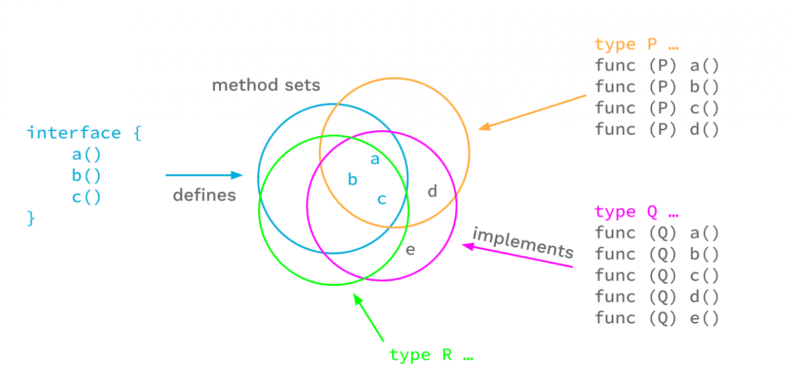
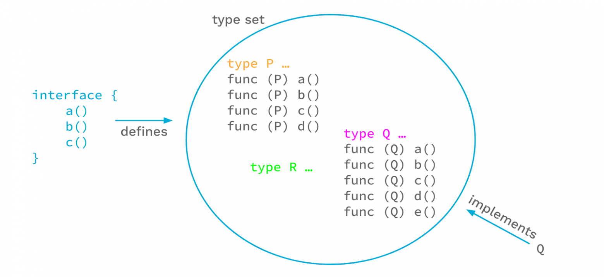

# Функции и структуры

## Зміст

0. [Структура коду](#Структура-кода)
    - [Іморт пакетів](#іморт-пакетів)
    - [Введення у модулі](#введення-у-модулі)
1. [Функції](#функции)
2. [Структури](#Структуры)
3. [Типи користувача](#пользовательские-типы)
4. [Методи структур](#методы-структур)
5. [Інтерфейси](#интерфейсы)
6. [Generics](#generics)

### Структура коду

Код усіх програм і проектів написаних на Go прийнято зберігати і структурувати опереним чином усередині однієї спільної
директорії

***Пакет*** - це одиниця організації коду в Go.

Усі файли `.go` з вихідним кодом, що містяться в одній директорії, зобов'язані мати однакове ім'я
пакету `package` `<my pakage name>`.

Go - мова чутлива до регістру ідентифікаторів (імен).

Все що називається з ***В***еликої літери - є доступним ззовні при імпортуванні пакета,
все що названо з ***м***аленкою - приватне і доступне тільки в рамках пакету.

Більш детально описано в офіційному посібнику - https://golang.org/doc/code.html

Наприклад:

```go
package main

import "fmt"

func main() {

	fmt.Println("Hello Go")
}
```

## Іморт пакетів

Якщо вже є готові пакети з потрібною функціональністю, яку ми хочемо використовувати, то для їх використання ми можемо
їх імпортувати в програму за допомогою оператора import. Наприклад, у прикладі вище задіюється функціональність
виведення повідомлення на консоль за допомогою функції Println, визначеної в пакеті fmt. Відповідно, щоб використовувати
цю функцію, необхідно імпортувати пакет fmt:

```go
import "fmt"
```

Нерідко програми підключають відразу кілька зовнішніх пакетів. У цьому випадку можна послідовно імпортувати кожен пакет:

```go
package main

import "fmt"
import "math"

func main() {

	fmt.Println(math.Sqrt(16)) // 4
}
```

Або щоб скоротити визначення імпорту пакетів можна укласти всі пакети в дужки:

```go
package main

import (
	"fmt"
	"math"
)

func main() {

	fmt.Println(math.Sqrt(16))
}
```

## Введення у модулі

> Модулі є набором пакетів Go, які мають вбудоване версіонування і які можемо опублікувати для використання в інших
> проектах.

Мова Go має багату функціональність, однієї цієї вбудованої функціональності може бути недостатньо для постоювання
програми. Однак, крім того, Go має велику екосистему розробників, які розробляють та публікують різні модулі. Ці модулі
можуть надавати функціональність, яка відсутня у вбудованій бібліотеці пакетів Go, але яка може бути нам потрібна. І Go
також дозволяє використовувати ці модулі. Розглянемо як створювати свої модулі та підключати та використовувати зовнішні
модулі у своєму додатку. Але починаючи з версії Go 1.16 для використання зовнішніх модулів необхідно визначити свій
модуль.

### Створення модуля

Для створення модуля використовується команда go mod init, якій передається ім'я модуля.

Спочатку визначимо папку, де розташовуватиметься наш модуль. Нехай, наприклад, це буде папка `~/go/src/golang`. Далі
перейдемо в терміналі/командному рядку до цієї папки. Допустимо, наш модуль буде називатися helloapp. Для його створення
виконаємо команду:

```bash
go mod init helloapp
```

Після виконання цієї команди у папці з'явиться файл go.mod. За умовчанням він матиме такий вміст:

```
module helloapp
 
go 1.19
```

Перший рядок з директивою module визначає шлях модуля - "helloapp". Другий рядок визначає версію go, що використовується
для модуля - в даному випадку 1.19.

Крім шляху модуля та версії go цей файл дозволяє керувати залежностями - зовнішніми модулями, які підключаються до
програми.

### Завантаження зовнішнього модуля

Тепер підключимо до нашого модуль helloapp зовнішній модуль. Наприклад візьмемо модуль "rsc.io/quote". Це модуль,
визначений спеціально для цілей тестування. Він містить набір функцій, які повертають текст.

Для завантаження модуля "rsc.io/quote" виконаємо команду:

```bash
go get rsc.io/quote
```

Під час виконання цієї команди Go завантажить необхідні залежності:

```
go: downloading rsc.io/quote v1.5.2
go: downloading golang.org/x/text v0.0.0-20170915032832-14c0d48ead0c
go: added golang.org/x/text v0.0.0-20170915032832-14c0d48ead0c
go: added rsc.io/quote v1.5.2
go: added rsc.io/sampler v1.3.0
```

Всі пакети, що загужуються, зберігаються на шляху `$GOPATH/pkg/mod`. Зазвичай змінне середовище GOPATH вказує на
папку `[Папка поточного користувача]/go`. Наприклад, у моєму випадку пакети завантажуватимуться за
адресою `~/go/pkg/mod`

І якщо ми знову відкриємо файл go.mod, то побачимо, що його вміст змінився:

```go
module helloapp

go 1.19

require (
golang.org/x/text v0.0.0-20170915032832-14c0d48ead0c // indirect
rsc.io/quote v1.5.2 // indirect
rsc.io/sampler v1.3.0 // indirect
)
```

У нього додалася директива require(), яка містить визначення залежностей, що підключаються. В даному випадку це всі ті
залежності, які потрібні для роботи з пакетом "rsc.io/quote".

Крім того, ми також можемо помітити, що в папці проекту c:\golang з'явився ще один файл - go.sum із вмістом наступного
типу:

```
golang.org/x/text v0.0.0-20170915032832-14c0d48ead0c h1:qgOY6WgZOaTkIIMiVjBQcw93ERBE4m30iBm00nkL0i8=
golang.org/x/text v0.0.0-20170915032832-14c0d48ead0c/go.mod h1:NqM8EUOU14njkJ3fqMW+pc6Ldnwhi/IjpwHt7yyuwOQ=
rsc.io/quote v1.5.2 h1:w5fcysjrx7yqtD/aO+QwRjYZOKnaM9Uh2b40tElTs3Y=
rsc.io/quote v1.5.2/go.mod h1:LzX7hefJvL54yjefDEDHNONDjII0t9xZLPXsUe+TKr0=
rsc.io/sampler v1.3.0 h1:7uVkIFmeBqHfdjD+gZwtXXI+RODJ2Wc4O7MPEh/QiW4=
rsc.io/sampler v1.3.0/go.mod h1:T1hPZKmBbMNahiBKFy5HrXp6adAjACjK9JXDnKaTXpA=
```

Цей файл містить контрольну суму для пакетів, що підключаються.

### Підключення зовнішнього модуля

Пакети із зовнішнього модуля підключаються так само, як і інші пакети за допомогою директиви import. Наприклад,
визначимо в папці `~/go/src/golang` власне файл коду main.go

Визначимо в main.go наступний вміст:

```go
package main

import (
	"fmt"
	"rsc.io/quote"
)

func main() {
	message := quote.Hello()
	fmt.Printf(message)
}
```

У цьому випадку викликається функція quote.Hello() з пакету "rsc.io/quote", яка повертає деяке повідомлення (точніше
рядок Hello World). І насамкінець запустимо програму на виконання:

```
> go run main.go
Hello, world.
```

# Функції

> Фунція - це блок коду, підпрограма, який можна викликати в інших частинах програми. Функція може мати
> ідентифікатор, прийняті та повертаються значення.

За допомогою функцій можна часто викликати її блок операторів як єдине ціле в інших частинах програми.

```go
func functionName(argumentName argumentType)(returnableName returnableType){
// function body
}
```

Функція може приймати від 0 до N у агрументів і при цьому повертати від 0 до M значень.

```go
func functionName(argA typeA, argC1, argC2  typeC, arr ...typeD)(retA typeE){
// function body
}
```

Функція визначається за допомогою ключового слова func, після якого відбувається ім'я функції. Потім у дужках іде список
параметрів. Після списку параметрів визначаються типи значень, що повертаються з функції (якщо функція повертає
значення). І далі у фігурних дужках йдуть ті оператори, з яких складається функція.

Назва функції разом із типами її параметрів і типами значень, що повертаються, ще називають сигнатурою.

За замовчуванням кожна програма на мові Go повинна містити щонайменше одну функцію - функцію main, яка є
вхідною точкою у додаток:

```go
package main

import "fmt"

func main() {
	fmt.Println("Hello Go")
}
```

### Closure. Замикання (Анонімні функції)

Анонімні функції - це функції, яким не призначено ім'я. Вони відрізняються від звичайних функцій також тим, що можуть
визначатися всередині інших функцій і можуть мати доступ до контексту виконання.

Анонімні функції дозволяють визначити певну дію безпосередньо там, де воно застосовується. Наприклад, нам
треба виконати складання двох чисел, але більше ніде ця дія в програмі не потрібна:

```go
package main

import "fmt"

func main() {

	f := func(x, y int) int { return x + y }
	fmt.Println(f(3, 4)) // 7
	fmt.Println(f(6, 7)) // 13
}
```

Також функції можуть приймати замикання як вхідні параметри або повертати замикання як результат виконання:
<details>
   <summary>Наприклад</summary>

```go
package main

import (
	"fmt"
	"time"
)

type Ny func() func(string) string

func main() {
	var myTime Ny
	myTime = sss()
	mt2 := myTime
	mt2()
	f := func() {
		str := myTime()("Johnny")
		println(str)
	}

	defer func() {
		println("defer executed")
	}()

	f()
}

func sss() func() func(string) string {
	start := time.Now()
	return func() func(string) string {
		fmt.Printf("Time from start %v", time.Since(start))
		return getTime
	}
}

func getTimer() func() {
	start := time.Now()
	return func() {
		fmt.Printf("Time from start %v\n", time.Since(start))
	}
}

func getTime(name string) string {
	return fmt.Sprintf("Hi, %s! %v", name, time.Now().String())
}

```

</details>

## Оператор defer

Оператор defer дозволяє виконати певну функцію в кінці програми, при цьому не важливо де в реальності
викликається ця функція.

<details>
   <summary>Наприклад</summary>

```go
package main

import (
	"fmt"
	"os"
)

func main() {
	fmt.Println("counting")

	for i := 0; i < 10; i++ {
		defer fmt.Println(i)
	}

	fmt.Println("done")
}

func Readfile(f string) ([]byte, error) {
	file, err := os.OpenFile(f, 0, 0666)
	if err != nil {
		return nil, err
	}
	defer file.Close()
	return nil, nil
}
```

</details>

У функції `Readfile` оператор служить для дуже корисної функції: не забути закрити файловий дескриптор після
різноманітних операцій із вмістом файлу.
У цьому прикладі `defer` функції `main` несе декоративний характер, але демонструє послідовність виконання
визначених за допомогою `defer` дій після завершення основного коду функції. А саме: їх послідовність
виконання назад порядку їх визначення. Таку послідовність можна описати як "закриття стеку викликів".

## panic & recover

Оператор panic дозволяє згенерувати помилку та вийти з програми:

```go
package main

import "fmt"

func main() {
	fmt.Println(divide(15, 5))
	fmt.Println(divide(4, 0))
	fmt.Println("Program has been finished")
}
func divide(x, y float64) float64 {
	if y == 0 {
		panic("Division by zero!")
	}
	return x / y
}
```

Оператору `panic` ми можемо передати будь-яке повідомлення, яке виводитиметься на консоль. Наприклад, у цьому випадку
функції `divide`, якщо другий параметр дорівнює 0, то здійснюється виклик `panic("Division by zero!")`.

У функції `main` у виклику `fmt.Println(divide(4, 0))` буде виконуватися оператор `panic`, оскільки другий параметр
функції `divide` дорівнює 0. І в цьому випадку всі наступні операції, які йдуть після цього виклику, наприклад, у цьому
випадку це виклик `fmt.Println("Program has been finished")`, не будуть виконуватися. У цьому випадку ми отримаємо
наступне виведення тексту в консоль:

```text
3
panic: Division by zero!
```

І наприкінці виведення йтиме діагностична інформація про те, де виникла помилка.

### Робота з recovery

У разі ситуації `panic` програма завершується. Завершення роботи реального додатку на помилці - це не найкраще, що
можливо. Потрібен якийсь механізм відновлення після помилки. У ситуації `panic` хотілося б мати код відновлення, що
допомагає уникнути небажаного завершення програми.

Функція `defer` завжди виконується при поверненні функції, причому виконуваної функції `ситуація` panic може виникати, а
може і не виникати. Ми можемо вказати всередині функції `defer` сценарій відновлення.

### Виявлення ситуації panic

Ми повинні перевірити всередині функції `defer`, чи виникала ситуація `panic` у виконанні функції. Для цього виконуємо
функцію відновлення `recover`. При виконанні `recover` всередині `функції` defer ми отримуємо код повідомлення про
помилку, що збігається зі значенням параметра, що передається до функції `panic`. Як результат від функції `recover`
повертається рядок, переданий у функцію panic. Це не дає завершитися програмі, що виконується, і повертає контроль над
нею. Згодом контроль передається зухвалої функції, яка продовжує виконання у звичайному режимі. Спробуємо все це на
прикладі:

```go
package main

import "fmt"

func recoveryFunction() {
	if recoveryMessage := recover(); recoveryMessage != nil {
		fmt.Println(recoveryMessage)
	}
	fmt.Println("This is recovery function...")
}

func executePanic() {
	defer recoveryFunction()
	panic("This is Panic Situation")
	fmt.Println("The function executes Completely")
}

func main() {
	executePanic()
	fmt.Println("Main block is executed completely...")
}
```

У цьому коді всередині функції `defer` ми викликаємо функцію відновлення `recover`, яка повертає повідомлення `panic`,
передане аргументом `panic` функції.

Так як ми використовуємо `recover`, функція не завершуватиметься негайно: контроль над функцією буде повернено до
виклику функції `main`, а виконання продовжиться в нормальному режимі. У такий спосіб відбудеться відновлення після
ситуації `panic`.

Результат виконання буде таким:

```text
This is Panic Situation
This is recovery function...
Main block is executed completely...

Process finished with the exit code 0
```

Тут бачимо, що функція не завершується. Вона повертає виконання в функцію main, що викликає, і далі виконання проходить
у звичайному режимі.

**Висновок**

`Golang` досить сильно відрізняється від інших мов програмування щодо обробки помилок.

# Структуры

Структури представляють тип даних, що визначається розробником і необхідне представлення будь-яких об'єктів. Структури
містять набір полів, які представляють різні атрибути об'єкта. Для визначення структури застосовуються ключові слова
type та struct:

```text
type имя_структуры struct{
    поля_структуры
}
```

Кожне поле має назву та тип даних, як змінна. Наприклад, визначимо структуру, яка представляє людину:

```go
package internal

type person struct {
	name string
	age  int
}

```

Структура називається `person`. Вона має два поля: name (ім'я людини, представляє тип string) та age (вік людини,
представляє тип int).

## Створення та ініціалізація структури

Структура представляє новий тип даних, і ми можемо визначити змінну цього типу:

``` go
var tom person
```

За допомогою ініціалізації можна передати структурі початкові значення:

```go
package person

type person struct {
	name string
	age  int
}

var tom person = person{"Tom", 23}
```

Ініціалізатор представляє набір значень у фігурних дужках. Причому ці значення передаються полям структури у порядку, у
якому поля визначено у структурі. Наприклад, у разі рядок " Tom " передається першому полю - name, а друге значення - 23
передається другому полю - age.

Також ми можемо явно вказати які значення передаються властивостям:

```go
package persons

type person struct {
	name string
	age  int
}

var alice person = person{age: 23, name: "Alice"}
```

Також можна використовувати скорочені способи ініціалізації змінної структури:

```go
var tom = person {name: "Tom", age: 24}
bob := person {name: "Bob", age: 31}
```

### Вкладені структури

Поля одних структур можуть становити інші структури.
<details>
   <summary>Наприклад</summary>

```go
package main

import "fmt"

type contact struct {
	email string
	phone string
}

type person struct {
	name        string
	age         int
	contactInfo contact
}

func main() {

	var tom = person{
		name: "Tom",
		age:  24,
		contactInfo: contact{
			email: "tom@gmail.com",
			phone: "+1234567899",
		},
	}
	tom.contactInfo.email = "supertom@gmail.com"

	fmt.Println(tom.contactInfo.email) // supertom@gmail.com
	fmt.Println(tom.contactInfo.phone) // +1234567899
}
```

</details>

У даному випадку структура людини має поле contactInfo, яке представляє іншу структуру contact.

Ви можете скоротити визначення поля таким чином:
<details>
   <summary>Code</summary>

```go
package main

import "fmt"

type contact struct {
	email string
	phone string
}

type person struct {
	name string
	age  int
	contact
}

func main() {

	var tom = person{
		name: "Tom",
		age:  24,
		contact: contact{
			email: "tom@gmail.com",
			phone: "+1234567899",
		},
	}
	tom.email = "supertom@gmail.com"

	fmt.Println(tom.email) // supertom@gmail.com
	fmt.Println(tom.phone) // +1234567899
}
```

</details>

Поле contact у структурі person фактичні еквівалентно властивості contact contact, тобто властивість називається contact
і представляє тип contact. Це дозволяє скоротити шлях до полів вкладеної структури. Наприклад, можемо написати
tom.email, а не tom.contact.email. Хоча можна використати і другий варіант.

# Вказівники

## Що таке вказівники (pointer)

Pointer є об'єктами, значенням яких є адреси інших об'єктів (наприклад, змінних).

Pointer визначається як звичайна змінна, лише перед типом даних ставиться символ зірочки`*`. Наприклад, визначення
pointer на об'єкт типу `int`:

```go
var p *int
```

Цьому pointer можна присвоїти адресу змінної типу `int`. Для отримання адреси використовується операція `&`, після якої
вказується ім'я змінної `(&x)`.

```go
package main

import "fmt"

func main() {

	var x int = 4  // Визначаємо змінну
	var p *int     // Визначаємо pointer на змінну
	p = &x         // pointer отримує адресу змінної
	fmt.Println(p) // значення самого pointer - адреса змінної x
}
```

Тут pointer p зберігає адресу змінної `x`. Що важливо, змінна `x` має тип `int` і pointer `p` вказує саме на об'єкт
типу `int`. Тобто має бути відповідність на кшталт. І якщо ми спробуємо вивести адресу змінної на консоль, то побачимо,
що вона становить шістнадцяткове значення:

```
0xc0420120a0
```

У кожному окремому випадку адреса може відрізнятися, але, наприклад, в моєму випадку машинна адреса змінної `x`

- `0xc0420120a0`. Тобто в пам'яті комп'ютера є адреса `0xc0420120a0`, за якою розміщується змінна `x`.

За адресою, яку зберігає pointer, ми отримаємо значення змінної x. Для цього застосовується операція * або операція
розіменування. Результатом цієї операції є значення змінної, яку вказує pointer. Застосуємо цю операцію та отримаємо
значення змінної `x`:

```go
package main

import "fmt"

func main() {

	var x int = 4
	var p *int = &x            // pointer отримує адресу змінної
	fmt.Println("Address:", p) // значення pointerа - адреса змінної x
	fmt.Println("Value:", *p)  // значення змінної x
}
```

Консольне виведення даної програми:

```
Address: 0xc0420c058
Value: 4
```

І також використовуючи pointer (, ми можемо змінювати значення за адресою, яка зберігається в pointerу:

```go
var x int = 4
var p *int = &x
*p = 25
fmt.Println(x) // 25
```

## Порожній pointer

Якщо вказівнику не присвоєно адресу будь-якого об'єкта, такий вказівник за замовчуванням має значення nil (по суті
відсутність значення). Якщо ми спробуємо отримати значення за таким порожнім pointerом, то зіткнемося з помилкою:

```go
var pf *float64
fmt.Println("Value:", *pf) // ! помилка, pointer не вказує на будь-який об'єкт
```

Тому при роботі з pointerами іноді буває доцільно перевіряти значення nil:

```go
var pf *float64
if pf != nil{
fmt.Println("Value:", *pf)
}
```

## Функція new

Змінна представляє іменований об'єкт у пам'яті. Мова Go також дозволяє створювати безіменні об'єкти – вони також
розміщуються у пам'яті, але не мають імені як змінні. Для цього використовується функція new(type). У цю функцію
передається тип, об'єкт якого потрібно створити. Функція повертає pointer на створений об'єкт:

```go
package main

import "fmt"

func main() {

	p := new(int)
	fmt.Println("Value:", *p) // Value: 0 - значення за замовчуванням
	*p = 8                    // змінюємо значення
	fmt.Println("Value:", *p) // Value: 8
}
```

У разі pointer p матиме тип *int, оскільки він свідчить про об'єкт типу int. Об'єкт, що створюється, має значення за
замовчуванням (для типу int це число 0).

Об'єкт, створений за допомогою функції new, нічим не відрізняється від звичайної змінної. Єдине, щоб звернутися до цього
об'єкта - отримати або змінити його адресу, необхідно використовувати pointer.

# Повернемося до структур

### Зберігання посилання на структуру того ж типу

При цьому треба враховувати, що структура не може мати поле, яке представляє тип цієї структури. Наприклад:

```go
type node struct{
value int
next node //Помилка!
}
```

Подібне визначення буде неправильним. Натомість поле має представляти pointer на структуру:

<details>
   <summary>Code</summary>

```go
package main

import "fmt"

type node struct {
	value int
	next  *node
}

// рекурсивный вывод списка
func printNodeValue(n *node) {

	fmt.Println(n.value)
	if n.next != nil {
		printNodeValue(n.next)
	}
}
func main() {

	first := node{value: 4}
	second := node{value: 5}
	third := node{value: 6}

	first.next = &second
	second.next = &third

	var current *node = &first
	for current != nil {
		fmt.Println(current.value)
		current = current.next
	}
}
```

</details>

Тут визначено структуру node, яка представляє типовий вузол однозв'язкового списку. Вона зберігає значення в полі value
та посилання на наступний вузол через pointer next.

У функції main створюються три пов'язані структури, і з допомогою циклу for і допоміжного pointerа current виводяться їх
значення.

Консольне виведення даної програми:

```
4
5
6
```

# Типи користувача

### Оголошення типів

Оператор типу дозволяє визначати іменований тип. Саме ванний тип ґрунтується на вже існуючому типі. Наприклад:

```go
type mile int
```

В даному випадку визначається тип mile, який ґрунтується на типі int. По суті mile представляє тип int і з ним
проводитиметься як і з типом int. Однак у той самий час фактично це новий тип.

Ми можемо визначати змінні цього типу, працювати з ними як з об'єктами базового типу int:

```go
package main

import "fmt"

type mile int

func main() {

	var distance mile = 5
	fmt.Println(distance)
	distance += 5
	fmt.Println(distance)
}
```

Але може виникнути питання, а навіщо це потрібно, навіщо створювати новий тип, якщо він все одно веде себе як тип int?
Розглянемо таку ситуацію:

```go
package main

import "fmt"

type mile int
type kilometer int

func distanceToEnemy(distance mile) {

	fmt.Println("відстань для супротивника:")
	fmt.Println(distance, "миль")
}

func main() {

	var distance mile = 5
	distanceToEnemy(distance)
	var distance2 kilometer = 5
	// distanceToEnemy(distance2)   // ! ошибка
}
```

Тут визначено два іменованих типи: mile і kilometer, які по суті представляють тип int і призначені для вираження
відстані в милях та кілометрах відповідно. І також визначено функцію distanceToEnemy(), яка відображає відстань в милях
до умовного супротивника. Як параметр приймає значення mile - саме значення типу mile, а чи не типу int.

Це дозволить нам зменшити можливість передачі некоректних даних. Тобто дані, що передаються, повинні бути явно визначені
в програмі як значення типу mile, а не типу int або типу kilometer. Таким чином, за допомогою саме ванних типів ми
надаємо типу деякий додатковий зміст.

Розглянемо ще один приклад:

```go
package main

import "fmt"

type library []string

func printBooks(lib library) {

	for _, value := range lib {

		fmt.Println(value)
	}
}

func main() {

	var myLibrary library = library{"Book1", "Book2", "Book3"}
	printBooks(myLibrary)
}
```

Тут визначено іменований тип library, який по суті є зрізом з рядків. Даний тип представлятиме своєрідну бібліотеку, яка
включає книги у вигляді їх рядкових назв. За допомогою функції printBooks можна вивести всі книги цієї бібліотеки. При
цьому функція printBooks працює саме з типом library, а не з будь-яким зрізом рядків.

# Методи структур та типів

Метод представляє функцію, що з певним типом. Методи визначаються як і звичайні функції за винятком, що у визначенні
методу також необхідно вказати одержувача чи receiver. Одержувач - це параметр типу, до якого прикріплюється метод:

```
func (ім'я_параметра тип_одержувача) ім'я_методу (параметри) (типи_результатів){
     тіло_метода
}
```

Допустимо, у нас буде визначений іменований тип, що представляє зріз з рядків:

```go
type library []string
```

Для виведення всіх елементів із зрізу ми можемо визначити такий метод:

```go
package internal

import "strings"

type library []string

// String Об'єднання у рядок
func (l library) String() string {
	return strings.Join(l, "; ")
}

// Print Друк library
func (l library) Print() {
	println(l.String())
}
```

Та частина, яка розташована між ключовим словом func та ім'ям методу та представляє визначення одержувача, для якого
буде визначено цей метод:` (l library)`. Використовуючи параметр одержувача (у разі `l`), ми можемо звертатися до
одержувача. Наприклад, у разі одержувач представляє зріз - набір об'єктів. За допомогою циклу for можна пройтися цим
зрізом і вивести всі його елементи на консоль.

Оскільки `Print` представляє саме метод, який визначений для типу library, а не звичайну функцію, ми можемо викликати
цей метод у будь-якого об'єкта типу library:

```go
var lib library = library{ "Book1", "Book2", "Book3" }
lib.Print() //  Book1; Book2; Book3
```

## Методи структур

Подібним чином ми можемо визначати методи і для структур:

```go
package main

import "fmt"

type person struct {
	name string
	age  int
}

func (p *person) print() {
	fmt.Println("Ім'я:", p.name)
	fmt.Println("Вік:", p.age)
}

func (p person) eat(meal string) {
	fmt.Println(p.name, "їсть", meal)
}

func main() {

	var tom = person{name: "Tom", age: 24}
	tom.print()
	tom.eat("борщ із капустою, але не червоний")
}
```

Консольне виведення даної програми:

```
Ім'я: Tom
Вік: 24
Tom їсть борщ з капустою, але не червоний
```

# Интерфейсы

> Інтерфейси представляють абстракцію поведінки інших типів. Інтерфейси дають змогу визначати функції, які не прив'язані
> до конкретної реалізації. Тобто, інтерфейси визначають деякий функціонал, але не реалізують його.

Для визначення інтерфейсу застосовується ключове слово: `interface`

```go
type /*`ім'я_інтерфейсу`*/ interface_name interface{
//`визначення_функцій`
}
```

Наприклад, найпростіше визначення інтерфейсу:

```go
type vehicle interface{
move()
}
```

Цей інтерфейс називається vehicle. Припустимо, цей інтерфейс є деяким транспортним засобом. Він визначає функцію move(),
яка не приймає жодних параметрів та нічого не повертає.

При цьому важливо розуміти, що інтерфейс - це абстракція, а не конкретний тип, як int, sring або структури. Наприклад,
ми не можемо безпосередньо створити об'єкт інтерфейсу:

```go
var v vehicle = vehicle{} //error
```

Інтерфейс представляє свого роду контракт, якому має відповідати тип даних. Щоб тип даних відповідав деякому інтерфейсу,
цей тип має реалізувати як методів всі функції цього інтерфейсу. Наприклад, визначимо дві структури:

<details>
   <summary>Code</summary>

```go
package main

import "fmt"

type Vehicle interface {
	move()
}

// структура "Автомобіль"
type Car struct{}

// структура "Літак"
type Aircraft struct{}

func (c Car) move() {
	fmt.Println("Автомобіль їде")
}
func (a Aircraft) move() {
	fmt.Println("Літак летить")
}

func main() {

	var tesla Vehicle = Car{}
	var boing Vehicle = Aircraft{}
	tesla.move()
	boing.move()
}
```

</details>

Тут визначено дві структури: Car та Aircraft, які, припустимо, уявляють, автомобіль та літак відповідно. Для кожної
структури визначено метод move(), який імітує переміщення транспортного засобу. Цей метод move відповідає функції move
інтерфейсу vehicle за типом параметрів і типом значень, що повертаються. Оскільки між методом структур та функцій в
інтерфейсі є відповідність, подібні структури неявно реалізують даний інтерфейс.

У Go інтерфейс реалізується неявно. Нам не треба спеціально вказувати, що структури застосовують певний інтерфейс, як і
в деяких інших мовах програмування. Для реалізації типу даних достатньо реалізувати методи, що визначає інтерфейс.

Оскільки структури Car і Aircraft реалізують інтерфейс Vehicle, ми можемо визначити змінні даного інтерфейсу, передавши
їм об'єкти структур:

```go
var tesla Vehicle = Car{}
var boing Vehicle = Aircraft{}
```

Де нам можуть допомогти інтерфейси? Інтерфейси дозволяють визначити якусь узагальнену реалізацію без прив'язки до
конкретного типу. Наприклад, розглянемо таку ситуацію:

<details>
   <summary>Code</summary>

```go
package main

import "fmt"

type Car struct{}
type Aircraft struct{}

func (c Car) move() {
	fmt.Println("Автомобіль їде")
}
func (a Aircraft) move() {
	fmt.Println("Літак летить")
}

func driveCar(c Car) {
	c.move()
}
func driveAircraft(a Aircraft) {
	a.move()
}

func main() {

	var tesla Car = Car{}
	var boing Aircraft = Aircraft{}
	driveCar(tesla)
	driveAircraft(boing)
}
```

</details>

Припустимо, в даному випадку визначено дві структури Car та Aircraft, які представляють автомобіль та літак. Для кожної
структури визначено метод переміщення `move()`, який умовно переміщає транспортний засіб. Також визначено дві
функції `driveCar()` і `driveAircraft()`, які приймають відповідно структури Car і Aircraft і призначені для водіння цих
транспортних засобів.

І чітко видно, що обидві функції `driveCar` і `driveAircraft` фактично ідентичні, вони виконують ті самі дії, тільки для
різних типів. І було б непогано, якби можна було б визначити одну узагальнену функцію для різних типів. Особливо
враховуючи, що у нас може бути і більше транспортних засобів велосипед, корабель тощо. І для керування кожним
транспортним засобом доведеться визначати свій метод, що не дуже зручно.

І саме в цьому випадку можна скористатися інтерфейсами:

<details>
   <summary>Code</summary>

```go
package main

import "fmt"

type Vehicle interface {
	move()
}

func drive(vehicle Vehicle) {
	vehicle.move()
}

type Car struct{}
type Aircraft struct{}

func (c Car) move() {
	fmt.Println("Автомобиль едет")
}
func (a Aircraft) move() {
	fmt.Println("Самолет летит")
}

func main() {

	tesla := Car{}
	boing := Aircraft{}
	drive(tesla)
	drive(boing)
}
```

</details>

Тепер замість двох функцій визначено одну загальну функцію - `drive()`, яка в якості параметра приймає значення типу
Vehicle. Оскільки цьому інтерфейсу відповідають обидві структури `Car` і `Aircraft`, ми можемо передавати ці структури
на
функцію drive як аргументів.

## Відповідність інтерфейсу

Щоб тип даних відповідав інтерфейсу, він має реалізувати всі методи цього інтерфейсу. Наприклад:
<details>
   <summary>Code</summary>

```go
package main

import "fmt"

type Stream interface {
	read() string
	write(string)
	close()
}

func writeToStream(stream Stream, text string) {
	stream.write(text)
}
func closeStream(stream Stream) {
	stream.close()
}

// структура файл
type File struct {
	text string
}

// структура папка
type Folder struct{}

// Реалізація методів типу *File
func (f *File) read() string {
	return f.text
}
func (f *File) write(message string) {
	f.text = message
	fmt.Println("Запис до файлу рядка", message)
}
func (f *File) close() {
	fmt.Println("Файл закритий")
}

// Реалізація методів типу *Folder
func (f *Folder) close() {
	fmt.Println("Папка закрита")
}

func main() {

	myFile := &File{}
	myFolder := &Folder{}

	writeToStream(myFile, "hello world")
	closeStream(myFile)
	//closeStream(myFolder) // Помилка: тип *Folder не реалізує інтерфейс Stream
	myFolder.close() // Так можна
}
```

</details>

Тут визначено інтерфейс `Stream`, який умовно представляє певний потік даних та визначає три методи: `close`, `read` та
`write`. І також є дві структури `File` та `Folder`, які представляють відповідно **файл** та **папку**. Для
типу `*File`
реалізовано всі три методи інтерфейсу `Stream`. А для типу `*Folder` реалізовано лише один метод інтерфейсу `Stream`.
Тому тип `*File` реалізує інтерфейс `Stream` і відповідає цьому інтерфейсу, а тип `*Folder` відповідає
інтерфейсу `Stream`. Тому скрізь, де потрібно об'єкт `Stream`, ми можемо використовувати об'єкт типу `*File`, але ніяк
не `*Folder`.

Наприклад, у функцію `closeStream()`, яка умовно закриває потік, як параметр передається об'єкт `Stream`. Під час
виклику в цю функцію можна передати об'єкт типу `*File`, який відповідає інтерфейсу `Stream`:

```go
closeStream(myFile)
```

А ось об'єкт `*Folder` передати не можна:

```go
closeStream(myFolder) // Помилка: тип *Folder не реалізує інтерфейс Stream
```

Але ми, як і раніше, можемо викликати у об'єкта `*Folder` метод close, але він розглядатиметься як власний метод, який
не має жодного відношення до інтерфейсу `Stream`.

Ще важливо відзначити, що в даному випадку методи реалізовані для типу `*File`, тобто pointer на об'єкт `File`, а не для
типу `File`. Це два різні типи. Тому тип `File`, як і раніше, НЕ відповідає інтерфейсу `Stream`. І ми, наприклад, не
можемо написати таке:

```go
myFile2 := File{}
closeStream(myFile2) //! Помилка: тип File не відповідає інтерфейсу Stream
```

Але можемо написати так:

```go
myFile2 := File{}
closeStream(&myFile2) 
```

## Реалізація кількох інтерфейсів

При цьому тип даних необов'язково має реалізувати лише методи інтерфейсу, для типу даних можна визначити його власні
методи або реалізувати методи інших інтерфейсів.

Наприклад:
<details>
   <summary>Code</summary>

```go
package main

import "fmt"

type Reader interface {
	read()
}

type Writer interface {
	write(string)
}

func writeToStream(writer Writer, text string) {
	writer.write(text)
}
func readFromStream(reader Reader) {
	reader.read()
}
```

</details>

У разі для типу `*File` реалізовані методи обох інтерфейсів - `Reader` і `Writer`.
Відповідно ми можемо використовувати об'єкти типу *File як об'єкти Reader та Writer.

## Вкладені інтерфейси

> Одні інтерфейси можуть містити інші інтерфейси.

Наприклад:

```go
package some

type Reader interface {
	read()
}

type Writer interface {
	write(string)
}

type ReaderWriter interface {
	Reader
	Writer
}
```

У цьому випадку для відповідності подібному інтерфейсу типи даних повинні реалізувати всі його інтерфейси.

Наприклад:

<details>
   <summary>Code</summary>

```go
package main

import "fmt"

type Reader interface {
	read()
}

type Writer interface {
	write(string)
}

type ReaderWriter interface {
	Reader
	Writer
}

func writeToStream(writer ReaderWriter, text string) {
	writer.write(text)
}
func readFromStream(reader ReaderWriter) {
	reader.read()
}

type File struct {
	text string
}

func (f *File) read() {
	fmt.Println(f.text)
}
func (f *File) write(message string) {
	f.text = message
	fmt.Println("Запись в файл строки", message)
}

func main() {
	myFile := &File{}
	writeToStream(myFile, "hello world")
	readFromStream(myFile)
	writeToStream(myFile, "lolly bomb")
	readFromStream(myFile)
```

</details>

У цьому випадку визначено три інтерфейси. Причому інтерфейс ReaderWriter містить інтерфейси Reader та Writer. Щоб
структура File відповідала інтерфейсу ReaderWriter, вона має реалізувати методи read і write, тобто методи обох
вкладених інтерфейсів, що тут і зроблено.

## Поліморфізм

> Поліморфізм представляє здатність набувати різноманітних форм.

Зокрема, у попередніх частинах було розглянуто використання інтерфейсів, яким можуть відповідати різні структури.
<details>
   <summary>Наприклад</summary>

```go
package main

import "fmt"

type Vehicle interface {
	move()
}

type Car struct{ model string }
type Aircraft struct{ model string }

func (c Car) move() {
	fmt.Println(c.model, "їде")
}
func (a Aircraft) move() {
	fmt.Println(a.model, "летить")
}

func main() {

	tesla := Car{"Tesla"}
	volvo := Car{"Volvo"}
	boeing := Aircraft{"Boeing"}

	vehicles := [...]Vehicle{tesla, volvo, boeing}
	for _, vehicle := range vehicles {
		vehicle.move()
	}
}
```

</details>

У даному випадку визначено масив vehicles, який містить набір структур, які відповідають інтерфейсу Vehicle, тобто Car і
Aircraft. Тобто об'єкт Vehicle може набувати різних форм: або структури Car, або структури Aircraft. При переборі масиву
кожного об'єкта викликається метод move. І в залежності від реального типу структури динамічно визначається яка саме
реалізація методу move для якої структури повинна викликатися.

Консольне виведення програми:

```text
Tesla їде
Volvo їде
Boeing летить
```

# Generics

І тепер перейдемо до нових понять.

## Навіщо потрібні дженерики?

Що ж таке «додавання дженериків» і навіщо це взагалі потрібно?
Програмування з використанням дженериків дозволяє надати функції та структури даних в узагальненій формі, з
факторизацією типів.

Як найпростіший приклад припустимо, що нам потрібно перерозподілити у зворотному порядку елементи зрізу. Це, зрозуміло,
не те завдання, з яким часто стикаються програмісти, а й нічого надзвичайного.

Припустимо, що це цілий масив.

```go
package test

func ReverseInts(s []int) {
	first := 0
	last := len(s)
	for first < last {
		s[first], s[last] = s[last], s[first]
		first++
		last--
	}
}
```

Найпростіша функція, але й у ній можна знайти помилку.

```go
package test

func ReverseInts(s []int) {
	first := 0
	last := len(s) - 1
	for first < last {
		s[first], s[last] = s[last], s[first]
		first++
		last--
	}
}
```

```go
package test

func ReverseInts(s []int) {
	first := 0
	last := len(s) - 1
	for first < last {
		s[first], s[last] = s[last], s[first]
		first++
		last--
	}
}
```

При визначенні змінної, що містить індекс останнього елемента, треба зменшити розмір зрізу на 1.

Тепер створимо функцію для здійснення такої операції з масивом рядків.

```go
package test

func ReverseStrings(s []string) {
	first := 0
	last := len(s) - 1
	for first < last {
		s[first], s[last] = s[last], s[first]
		first++
		last--
	}
}
```

Порівнявши функції ReverseInts та ReverseStrings, ви побачите, що вони відрізняються лише типом параметра.

Тим, хто починає вивчати Go, може здатися дивним, що неможливо написати просту функцію Reverse, яка працюватиме з даними
будь-якого типу. Адже в більшості інших мов така можливість є.

У мовах з динамічною типізацією, як-от Python або JavaScript, функцію можна написати, не звертаючи уваги на визначення
типу елементів. На Go такий спосіб не спрацює, оскільки це мова зі статичною типізацією і вимагає точної вказівки типу
зрізу та його елементів. Більшість інших мов зі статичною типізацією, таких як C++, Java, Rust або Swift, підтримує
дженерики, щоб усунути цю проблему.

## Як Go обходиться без дженериків

### Інтерфейси

Створити функцію, яка може обробляти різні типи даних Go можна, використовуючи інтерфейсний тип. Для цього потрібно
визначити методи тих типів зрізів, які ви маєте намір передавати функції. Саме так працює функція sort.Sort із
стандартної бібліотеки.

Іншими словами, відсутність дженериків у Go можна компенсувати за допомогою інтерфейсів. Вони допомагають виділити
загальні аспекти різних типів і висловити їх як методи. Таким чином, ми можемо створювати функції, які будуть обробляти
будь-які типи, що підтримують ці методи.

Але за такого підходу доводиться писати методи для інтерфейсів вручну. Досить незручно визначати окремий тип із парою
методів просто для того, щоб перерозподілити елементи зрізу. А оскільки методи для кожного типу будуть ідентичні, ми не
позбулися коду, що дублюється, просто пересунули його. І хоча інтерфейси дозволяють реалізувати деякі елементи
дженериків, повної функціональності вони не дають.

### Методи за замовчуванням

Ще один спосіб, при якому нам не доведеться самостійно писати методи - визначення в самій мові методів за замовчуванням
для деяких типів. В даний час такий підхід не підтримується в Go, але, наприклад, в мові можна було б визначити для
кожного масиву метод Index, що повертає елемент. Однак, щоб використовувати цей спосіб на практиці, метод повинен
повертати порожній інтерфейсний тип, а в такому випадку ми втратимо всі переваги статичного типування. Більше того, ми
не змогли б створити функцію, яка приймає два зрізи з елементами одного типу або map з елементами певного типу та
повертає зріз. Статична типізація полегшує Go створення великих програм. І не хотілося б втрачати цю перевагу заради
плюсів, які дають дженерики.

### Пакет reflect

Ще один варіант - написати функцію Reverse за допомогою пакета `reflect`, але це настільки незручно і непрактично, що
майже ніхто так не робить. Крім того, цей підхід потребує чіткого визначення типів і не допускає їх статичної перевірки.

### Генератори коду

Можна також написати генератор коду, який приймає тип та генерує функцію Reverse для зрізів цього типу. Існує кілька
відповідних генераторів коду. Але це додає зайвий крок у будь-який пакет, що включає функцію Reverse, що ускладнює
складання, оскільки вимагає компіляцію всіх копій. Також виправлення бага у джерелі вимагає перегенерації всіх
інстансів, деякі з яких можуть використовуватись навіть в інших проектах.

Усі описані підходи настільки незручні, що у більшості випадків за необхідності перерозподілити елементи зрізу просто
пишуть окремі функції кожного типу, який планують використовувати. Потім для кожної функції потрібно написати та
провести тести, щоб відловити всі помилки на кшталт тієї, що у першому прикладі.

Чи не надто багато зайвої роботи для функцій, які відрізняються тільки типом елемента? Має бути спосіб набагато кращий!

Для статично типізованих мов цей спосіб дженерики. Як було сказано на початку, використання дженериків дозволяє
виключати типи, а це саме те, що нам потрібно.

> Дженерики - це спосіб написання коду, який не залежить від конкретних типів, що застосовуються. Функції та типи можуть
> бути написані для будь-якого набору типів.

З дженериками до Go додаються три важливі функціональні можливості:

1. Типи як параметри для функцій та типів.
2. Визначення інтерфейсних типів як наборів типів, зокрема типів без методів.
3. Виведення типу, коли у багатьох випадках типи аргументів під час виклику функції опускаються.

## Типи як параметри

У функціях та типах тепер параметром може бути тип. Список таких параметрів виглядає як список звичайних параметрів, але
замість круглих дужок використовуються квадратні.

Щоб показати принцип роботи, почнемо з простої функції `Min` без параметрів для значень з плаваючою точкою:

```go
package gtest

func Min(x, y float64) float64 {
	if x < y {
		return x
	}
	return y
}
```

Параметризуємо цю функцію для роботи з різними типами замість типу `float64` додавши список з одним параметром типу T:

```go
package gtest

import "golang.org/x/exp/constraints"

func GMin[T constraints.Ordered](x, y T) T {
	if x < y {
		return x
	}
	return y
}
```

І викличемо її з типом як аргумент:

```go
package main

import "test/gtest"

func main() {
	println(GMin[int](2, 3))
}
```

Вказівка в `GMin` типу `int` як аргумент називається інстанціюванням. У компіляторі інстанція відбувається у два етапи:

1. Заміна всіх аргументів-типів на відповідні типи параметри.
2. Перевіряє, що кожен тип відповідає своїм обмеженням. Деталі пізніше. Якщо другий етап не пройдено, інстанціювання не
   відбувається і програма не працюватиме.

Після інстанцування функція, що залишилася без параметрів, викликається так само, як і будь-яка інша. Наприклад, у цьому
коді:

```go
fmin := GMin[float64]
m := fmin(2.71, 3.14)
```

при інстанціюванні GMin[float64] фактично виходить вихідна функція Min для значень з плаваючою точкою. Цю функцію можна
викликати.

У типів тепер також можуть бути параметри:

```go
package main

type Tree[T any] struct {
	left, right *Tree[T]
	value       T
}

func (t *Tree[T]) Lookup(x T) *Tree[T] { ... }

var stringTree Tree[string]
```

Тут у дженерик-типі `Tree` зберігаються значення параметра типу `T`. У дженерик-типах можуть бути й методи, такі
як `Lookup`
вище. Щоб використати дженерик-тип, його потрібно інстанціювати. `Tree[string]` - приклад інстанціювання Tree з
типом-аргументом string.

## Набори типів

Розглянемо докладніше аргументи-типи, які застосовуються для інстанціювання типу як параметра.

Звичайна функція для кожного значення параметра має тип, що визначає можливий набір значень. Так, у нашій функції Min з
типом float64 для аргументу допустимо набір значень із плаваючою точкою, які можуть бути представлені цим типом.

Аналогічно, у списках типів як параметрів тип має кожен параметр. Але тип-параметр сам собою тип, отже, типи-параметри
визначають набори типів. Такий набір (метатип) називається обмеженням типу.

У параметризованій функції GMin обмеження типу імпортується з пакету constrains. В обмеженні Ordered описується набір
всіх типів зі значеннями, які можна впорядкувати або, іншими словами, порівняти через оператори `<`(або `<=`, `>` і
т.д.).

Це обмеження гарантує передачу GMin тільки типів з упорядкованими значеннями. Крім того, значення цього типу параметра
можуть використовуватися в тілі функції GMin з оператором порівняння `<`.

Go обмеження типу повинні бути інтерфейсами, тому інтерфейсний тип може бути типом для значення і метатипом. Інтерфейси
визначають способи. Тому очевидно, що ми можемо висловити обмеження типу, які потребують певних методів.

Але `constraints.Ordered` - це також інтерфейсний тип, а оператор не є методом. Тут потрібно глянути на інтерфейси
по-новому.

До недавнього часу в специфікації Go було заявлено, що інтерфейс визначає набір методів, що приблизно відповідає
перерахованому в інтерфейсі набору. Будь-який тип, що реалізує всі методи набору, реалізує відповідний інтерфейс:



Але можна сказати, що інтерфейс визначає набір типів, які реалізують методи набору. З цієї точки зору будь-який тип,
який є елементом набору інтерфейсу, реалізує інтерфейс.

Подивіться нижче:



Два цих підходи призводять до одного результату: для кожного набору методів можна представити відповідний набір типів,
що реалізують ці методи, і це набір типів, що визначаються інтерфейсом.

Але для наших цілей підхід з набором типів є кращим: можна явно додавати типи в набір і, таким чином, по-новому керувати
набором типів. І тому ми розширили синтаксис інтерфейсних типів. Наприклад, `interface{int|string|bool}` визначає набір
типів `int`, `string` та `bool`:

```go
package constraints

type Integer interface {
	~int | ~int64 | ~int32 | ~int8 | ~int16
}

type Float interface {
	~float32 | ~float64
}

type Ordered interface {
	Integer | Float | ~string
}
```

Тут інтерфейс `Ordered` - це набір всіх цілих типів, типів числа з плаваючою точкою і рядкових типів. Вертикальна смуга
позначає об'єднання типів (або наборів типів у разі).

`Integer` та `Float` це інтерфейсні типи, аналогічно визначеним у пакеті constraints. Зверніть увагу: немає методів, які
визначаються інтерфейсом `Ordered`.

Щодо обмежень типу, конкретний тип (наприклад, `string`) нас зазвичай не так цікавить, як усі рядкові типи. Ось навіщо
потрібний токен `~`: вираз `~string` означає набір всіх типів з базовим типом string. Це сам тип string і всі типи,
оголошені такими визначеннями, як type `MyString string`.

Звичайно, методи все одно потрібно вказувати в інтерфейсах та зі збереженням зворотної сумісності. У **Go 1.18**, як і
раніше, в інтерфейсі можуть мати місце методи і вбудовані інтерфейси, а також вбудовані неінтерфейсні типи, об'єднання
та набори базових типів.

Набір типів, що визначаються інтерфейсом, коли інтерфейс використовується як обмеження типу, точно вказує типи,
дозволені як типи-аргументи для відповідного параметра типу.

У тілі параметризованої функції, тип операнда якої - тип-параметр `P` з обмеженням `C`, операції дозволені, якщо вони
дозволені всіма типами в наборі типів `C`. Нині тут є низка обмежень реалізації, але у звичайному коді зустріч із нею
малоймовірна.

Використовуваним як обмеження інтерфейсам можна надавати імена (наприклад, Ordered). Або вони можуть бути літеральними
інтерфейсами, вбудованими до списку типів-параметрів. Наприклад:

```go
[S interface{~[]E}, E interface{}]
```

Тут S це тип зрізу, тип конкретного елемента зрізу може бути будь-яким.

Це типовий випадок, тому зовнішній interface{} для інтерфейсів у позиції обмеження можна опустити і просто написати:

```go
[S ~[]E, E interface{}]
```

Порожній інтерфейс часто зустрічається у списках типів як параметрів, та й у звичайному коді на Go теж. Тому в якості
псевдоніма для порожнього інтерфейсного типу в Go 1.18 з'явився новий ідентифікатор any, що попередньо оголошується. З
ним отримуємо ідіоматичний код:

```go
[S ~[]E, E any]
```

Інтерфейси як набори типів це новий потужний механізм та ключовий фактор для роботи обмежень типу на Go. Поки що
інтерфейси з новими синтаксичними формами можуть використовуватися лише як обмеження, але неважко уявити, наскільки в
цілому можуть бути корисні обмежуючі тип інтерфейси з явним визначенням типів.

## Виведення типів

Нова значна можливість мови виведення типів. Це найскладніше, але й важливе нововведення, що при написанні коду
застосування природного стилю, де викликаються параметризовані функції.

### Виведення типу-аргументу функції

З типами-параметрами пов'язана необхідність передачі типів як аргументів, що може призвести до перевантаження коду.

Повернемося до параметризованої функції GMin:

```go
func GMin[T constraints.Ordered](x, y T) T { ... }
```

Тип параметр T потрібен, щоб не вказувати звичайні типи x і y. Як ми бачили раніше, ця функція може викликатись за
допомогою аргументу з явно заданим типом:

```go
var a, b, m float64

m = GMin [float64] (a, b) // explicit type argument
```

У компіляторі у часто тип-аргумент для `T` може виводитися з звичайних аргументів. Результат такий самий точний код, але
коротше:

```go
var a, b, m float64

m = GMin(a, b) // no type argument
```

Ефект досягається зіставленням типів аргументів a та b з типами параметрів x та y.

Таке виведення аргументів-типів із типів аргументів у функцію називається виведенням типу аргументу функції. Воно
відбувається лише для параметрів типу, які використовуються у параметрах функції, а не виключно у результатах функції
або її тілі.

Наприклад, виведення типу не застосовується до таких функцій, як `MakeT[T any]()` `T`, у яких `T` використовується
тільки для результату.

## Виведення типу обмеження

Мова підтримує виведення типу обмеження. Щоб описати його, почнемо з цього прикладу масштабування зрізу цілих чисел:

```go
package main

// Scale returns a copy of s with each element multiplied by c.
// This implementation has a problem, as we will see.
func Scale[E constraints.Integer](s []E, c E) []E {
	r := make([]E, len(s))
	for i, v := range s {
		r[i] = v * c
	}
	return r
}
```

Це параметризована функція, вона працює для зрізу будь-якого цілого типу.

Розглянемо багатовимірний тип Point, де кожен Point це список цілих чисел, що визначають координати точки. Звичайно, цей
тип має методи:

```go
package main

type Point []int32

func (p Point) String() string {
	// Details not important.
}
```

Щоб масштабувати Point, знадобиться функція Scale:

```go
package main

func Scale[E constraints.Integer](s []E, c E) []E {
	r := make([]E, len(s))
	for i, v := range s {
		r[i] = v * c
	}
	return r
}

type Point []int32

func (p Point) String() string {
	// Details not important.
}

// ScaleAndPrint doubles a Point and prints it.
func ScaleAndPrint(p Point) {
	r := Scale(p, 2)
	fmt.Println(r.String()) // DOES NOT COMPILE
}
```

Але вона компілюється і завершується помилкою

```
r.String undefined (type []int32 has no field or method String)
```

Проблема полягає в тому, що функція Scale повертає значення типу `[]E`, де `E` це тип елемента зрізу аргументу. Коли ми
викликаємо `Scale` зі значенням типу `Point`, базовий тип якого - `int32`, то отримуємо значення типу `int32`, а
не `Point`. Це зумовлено самим способом написання коду (дженериком). Але це не те, що нам тут потрібне.

Вирішимо проблему, змінивши функцію `Scale` для типу зрізу використовуємо тип-параметр:

```go
package main

// Scale returns a copy of s with each element multiplied by c.
func Scale[S ~[]E, E constraints.Integer](s S, c E) S {
	r := make(S, len(s))
	for i, v := range s {
		r[i] = v * c
	}
	return r
}
```

Ми ввели новий тип-параметр зрізу `S` і обмежили його так, щоб базовим типом став `S`, а не `[]E`, і типом результату 
також був `S`. Але `E` може бути лише цілим числом, тому ефект той самий, що й раніше: перший аргумент має бути 
зрізом цілого типу. Єдине зміна у тілі функції: коли ми викликаємо make - передаємо `S`, а не `[]E`.

Поведінка нової функції - така сама, як і в колишньої, якщо викликати її за допомогою звичайного зрізу. Якщо
використовувати тип `Point`, то отримаємо значення типу Point. Це те що нам потрібно. У цій версії `Scale` більш рання
функція `ScaleAndPrint` компілюватиметься і запускатиметься, як ми очікуємо.

Але чому можна писати виклик до Scale без передачі аргументів із явно заданим типом? Тобто чому, замість писати
`Scale[Point, int32](p, 2)`, ми можемо написати `Scale(p, 2)` без типів-аргументів?

У новій функції Scale тепер два типи-параметри: `S` і `E`. Оскільки при викликі до Scale жодних типів-аргументів не
передається, то описаний вище механізм виведення типу-аргументу функції дозволяє компілятору як тип-аргумент для `S`
вивести `Point`.

Але функція має ще тип-параметр `E`, це тип множника с. Відповідний аргумент функції дорівнює 2, а оскільки 2 - це
нетипізована константа, висновок типу аргументу функції не може вивести правильний тип для `E`: у кращому випадку він може
вивести тип за промовчанням для 2 - int, що неправильно.

Натомість відбувається процес, за допомогою якого в компіляторі виводиться, що тип-аргумент для `E` - це тип елемента
зрізу. Цей процес називається виведенням типу обмеження. Типи-аргументи виводяться з обмежень параметрів типу.

Виведення типу обмеження застосовується, коли один тип-параметр має обмеження, що визначається як інший тип-параметр.
Коли тип-параметр одного з таких парметрів відомий, обмеження використовується для виведення типу-аргументу іншого
типу-аргументу.

Звичайний випадок застосування такого висновку коли в одному обмеженні використовується форма ~type для типу, який
записується за допомогою інших типів-параметрів. Ми бачимо це у прикладі зі Scale.

Тут `S` - це `~[]E`, тобто `~`, за яким йде тип `[]E`, написаний як інший тип-параметр. Якщо знаємо тип-аргумент для `S`
, можемо вивести і тип-аргумент для `E`. `S` це тип зрізу, а `E` тип елемента цього зрізу.

Ми розглянули лише основи виведення типу обмеження. Подробиці дивіться у документі з пропозицією або специфікації мови.

## Виведення типу на практиці
Механізм виведення типу складний, але застосовувати його просто: виведення типу відбувається або ні. Якщо тип
виводиться, типи-аргументи можна опустити - тоді виклик параметризованих функцій нічим не відрізняється від звичайних
функцій. Якщо виведення типу не відбувається, у компіляторі видається повідомлення про помилку, тоді ми можемо просто
вказати необхідні типи-аргументи.

Додаючи в мову виведення типу, ми прагнули оптимального поєднання можливостей і складності щоб типи, що виводяться в
компіляторі, ніколи не викликали здивування. Ми намагалися виключити можливість виведення невірного типу, краще він не
буде виведений.

Можливо, у нас це не зовсім вийшло, і у майбутніх випусках робота у цьому сенсі буде продовжена. У результаті можна буде
написати більше програм без аргументів із явно заданим типом. Програмам, яким типи як аргументи не потрібні сьогодні,
такі аргументи не знадобляться і завтра.